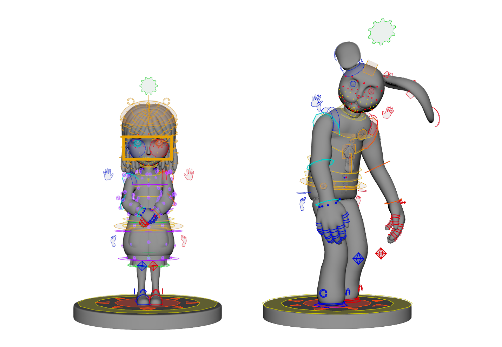

# ldRigNodes-maya

This repository contain the source code of my C++ rig nodes for Autodesk Maya 2022+ and the assosiated python scripts.

## Project context

This project was made for the production of "Ferme les Yeux" (Project IZES) at [Pôle 3D](https://pole3d.com/en/homepage/), a movie made for my master graduation.

You can find the trailer on this page: https://vimeo.com/730542293

**Since the project is finished, this repository is only available for archival reasons (no support).**

## Documentation
The project containts 2 subprojects:
- C++ - Custom nodes :  https://www.leodepoix.fr/ldRigNodes-maya
- Python - Rigging scripts : *no documentation*

## Acknowledgement
This project was made with the help and the support of these persons:
- Guillaume Baratte, technical teacher at [Pôle 3D](https://pole3d.com/en/homepage/) - https://www.linkedin.com/in/guillaume-baratte-5303557/
- Louis Lukasik - https://www.linkedin.com/in/louis-lukasik/
- Benjamin Langagne - https://www.linkedin.com/in/benjaminlangagne/
- The "Ferme les Yeux" team - https://pole3d.com/en/project/ferme-les-yeux-2022-2/